# Pankov-UPIIS-lab1
## Этапы работы над лабораторной работой:
### 1. Создание репозитория на GitHub:
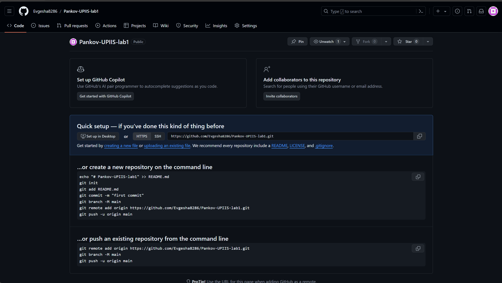

### 2. Создал репозиторий локально с помощью Git:
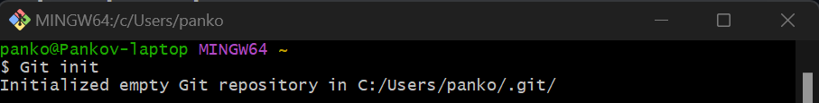

### 3. Перешел в созданный локальный репозиторий:
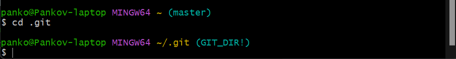

### 4. Создал в репозитории файлы DOC.md, README.md, main1.py и main2.py:
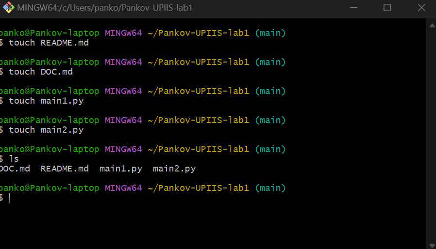

### 5. Заполнил файл DOC.md с помощбю VS CODE в разметке markdown:
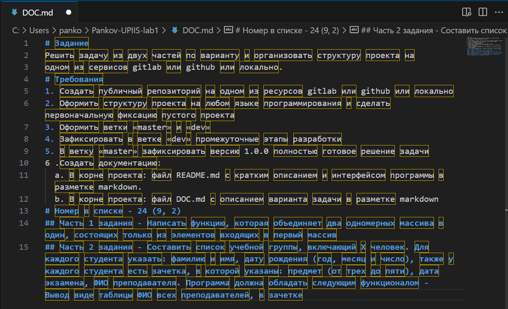

### 6. Написал программу для первой части задание и сохранил в файл main1.py:
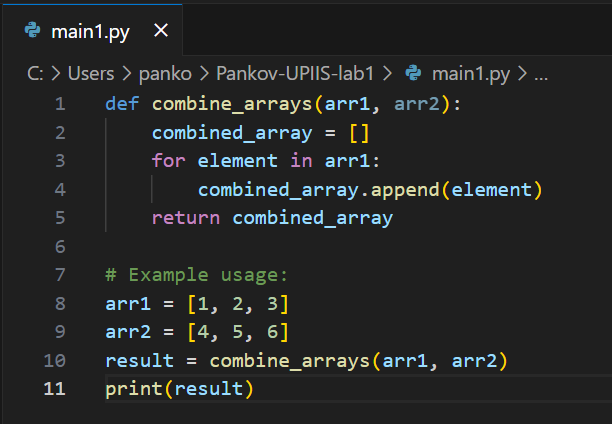

### 7. Написал программу для второй части задание и сохранил в файл main2.py:
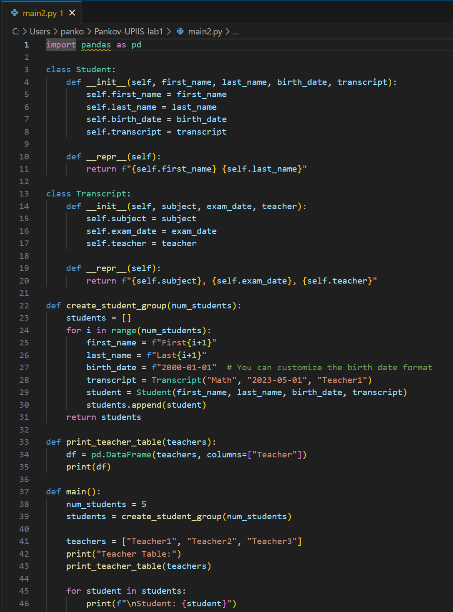

### 8. Добавил все файлы в текущей папке в индекс Git:
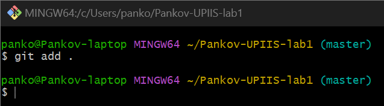

### 9. Создал первоначальную фиксацию пустого проекта в Git Bush:
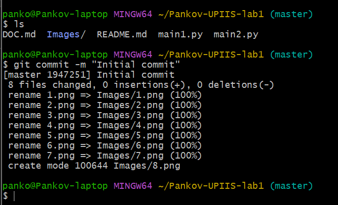

### 10. Создал ветку dev и переключился на неё и обратно:
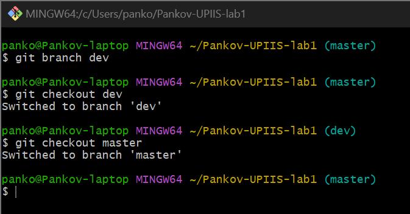

### 11. Объединил две ветки (master и dev) и назначил версию:
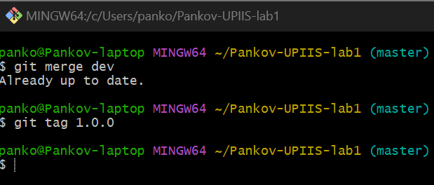

### 12. Запушил проект на GitHub с локального Git:
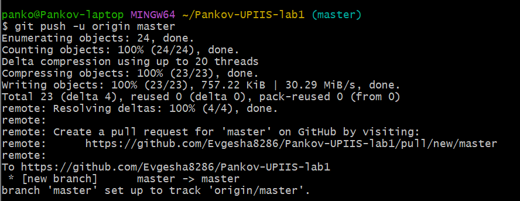
