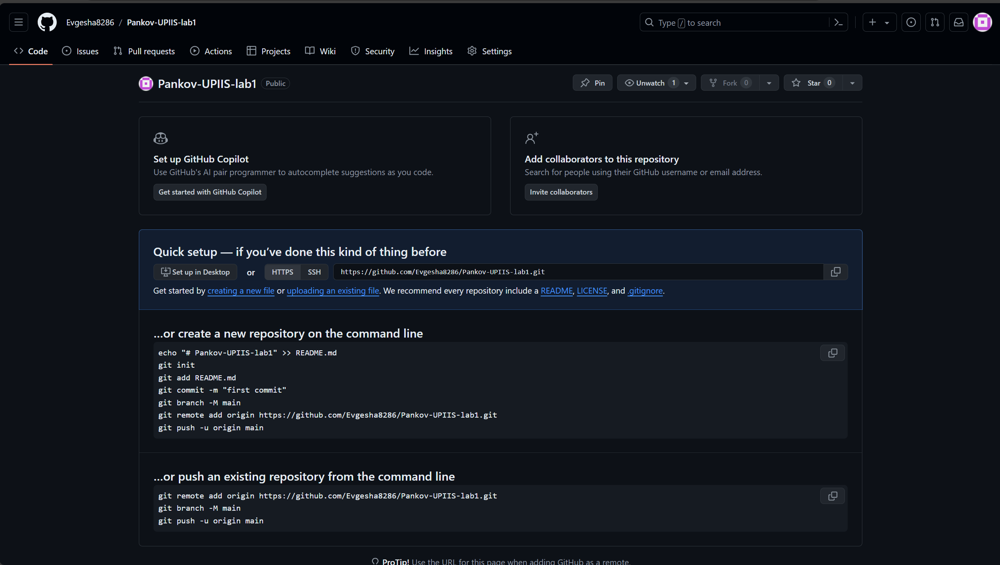
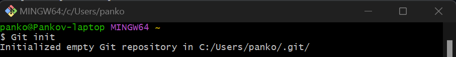
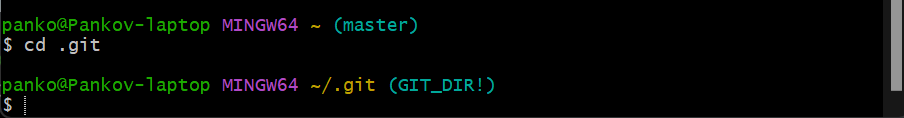
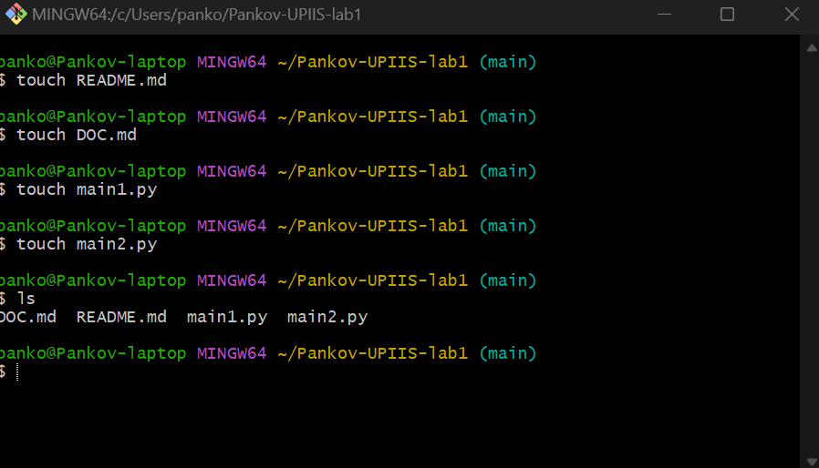
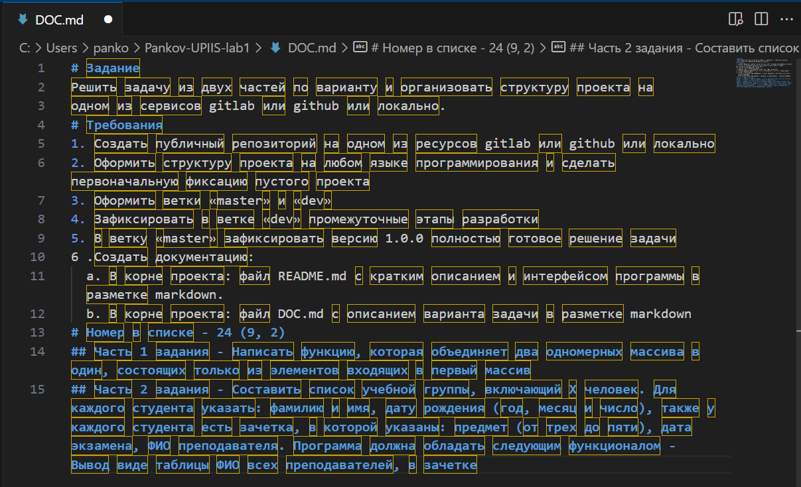
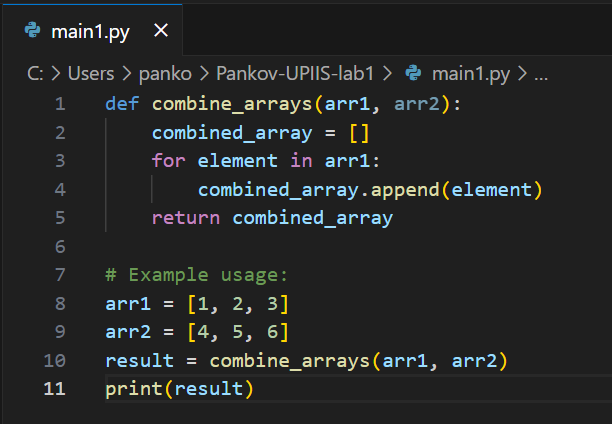
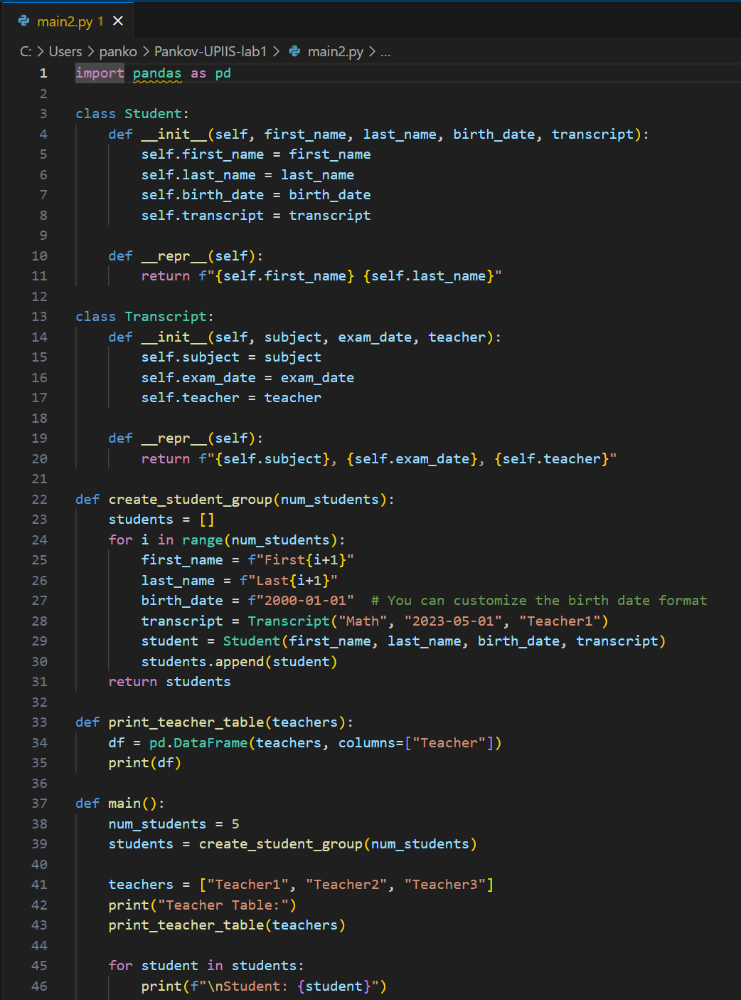

# Pankov-UPIIS-lab1
## Этапы работы над лабораторной работой:
### 1. Создание репозитория на GitHub:

### 2. Создал репозиторий локально с помощью Git:

### 3. Перешел в созданный локальный репозиторий:

### 4. Создал в репозитории файлы DOC.md, README.md, main1.py и main2.py:

### 5. Заполнил файл DOC.md с помощбю VS CODE в разметке markdown:

### 6. Написал программу для первой части задание и сохранил в файл main1.py:

### 7. Написал программу для второй части задание и сохранил в файл main2.py:

### 8. Создал первоначальную фиксацию пустого проекта в Git Bush:
